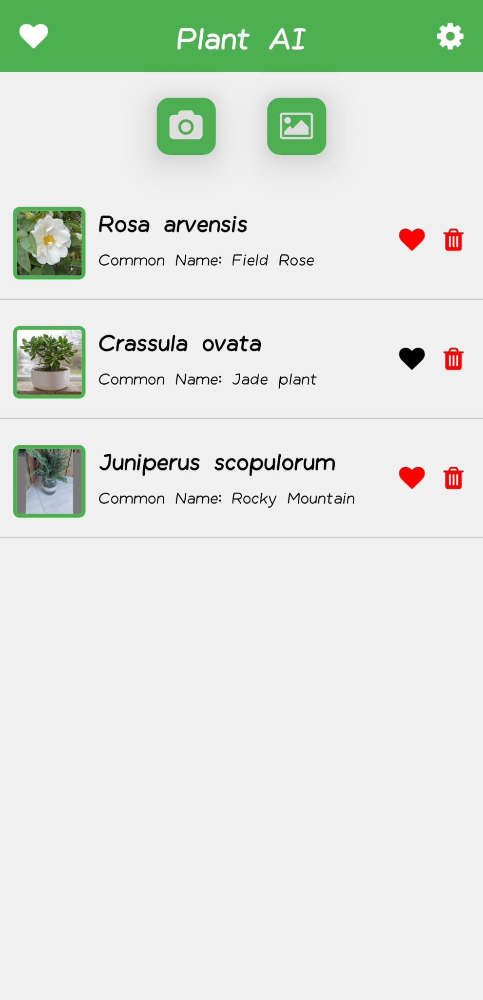

# Plant Recognition App

## 📖 Description

**Plant Recognition App** is a simple Android App that allows you to identify plants using an image. It uses the **Pl@ntNet API** as the AI model, this App requires a **Pl@ntNet account**.  
Plants can be identified using the phone camera or a photo from the gallery, it also show a history of identified plants, and a favourites plant system.
## 🚀 Main features

✅ **Plant identification via image**: Allows to identify plants via the **Pl@ntNet API**.  
✅ **History of identified plants**: History of the last 30 identified plants.  
✅ **Favourite plant system**: Any plant can be marked as favourite and will be stored for always.  
✅ **User-friendly interface**: Intuitively designed and easy-to-use application.  

## 📸 Images

  
  
  

## 🛠️ How to use

1️⃣ **Enable permissions:** Enable camera and local storage permissions requested by the app.  
2️⃣ **Set Pl@ntNet API Key:** Create an account or log in to the **Pl@ntNet API**, copy your **API Key** and configure it in the application.  
3️⃣ **Identify a plant:** Take a photo or select an image from the gallery, then select the best correlation of the results obtained.  
4️⃣ **Set as favourite:** Delete the identified plant or save it forever by marking it as a favourite.  

## 📄 License

This project is licensed under the **MIT** license.

The image-based plant species identification service used, is based on the **Pl@ntNet recognition API**, regularly updated and accessible through the site https://my.plantnet.org/
